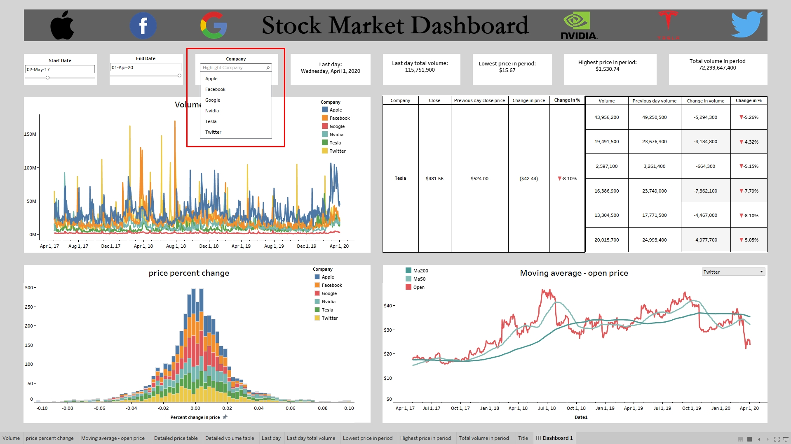
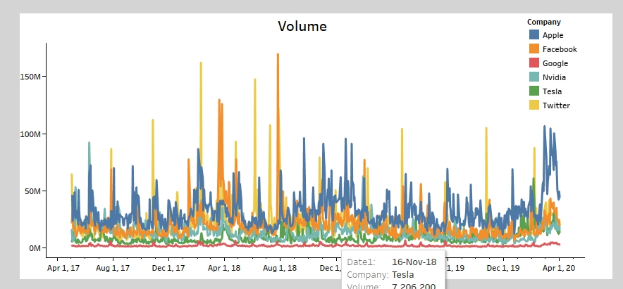
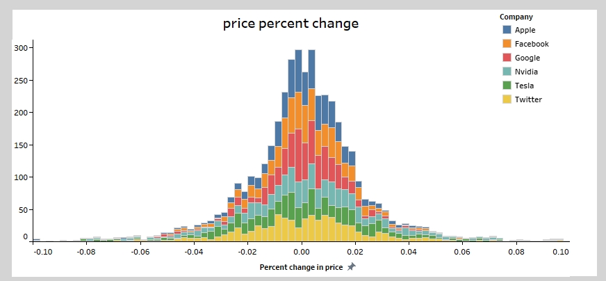
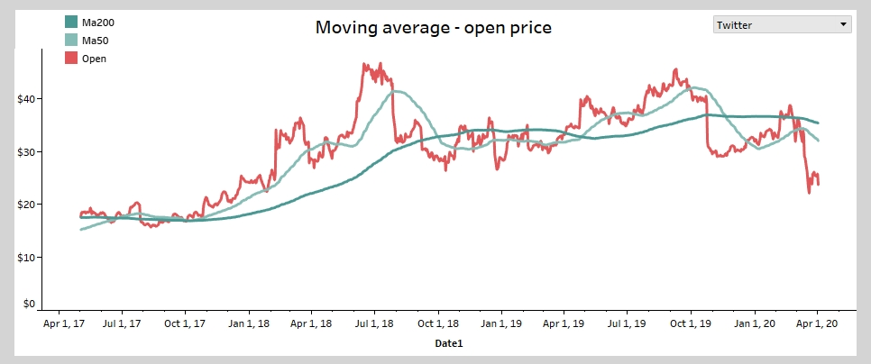
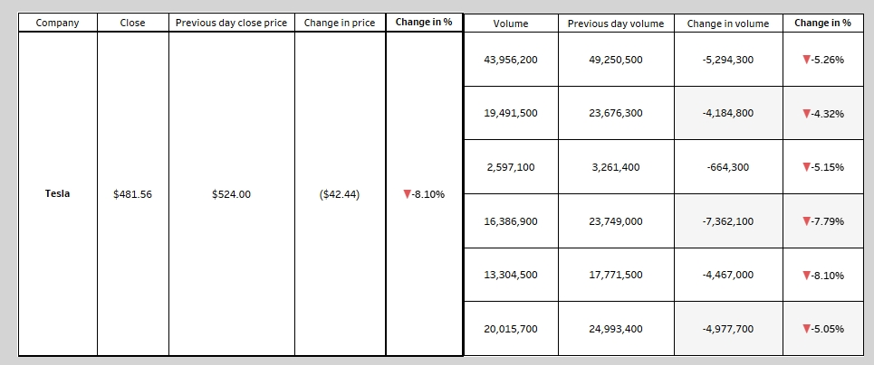
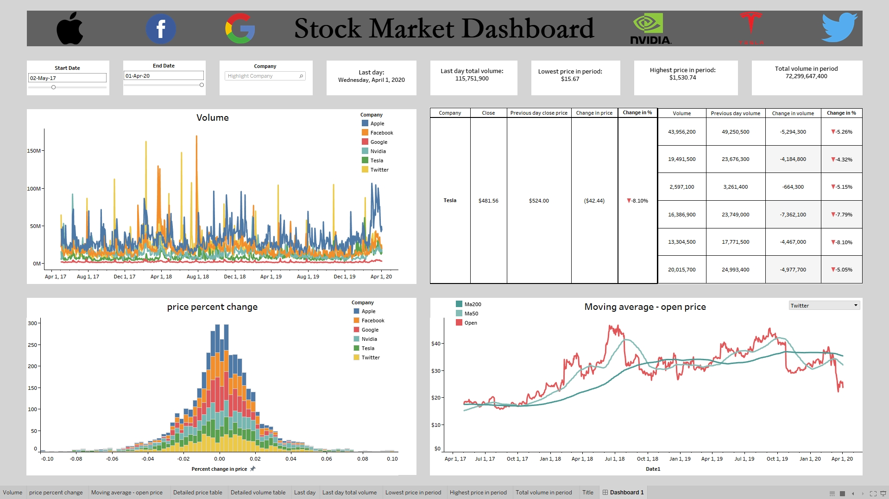

# Stock Market Dashboard

## Overview
This project demonstrates the creation of an interactive **Stock Market Dashboard** using **Power BI** and **Excel**. It provides key insights into stock performance through advanced visualizations.

---

## Key Features

### 1. **Dynamic Filtering**
- Users can filter data by custom date ranges or select specific companies to focus on.
- This allows for a tailored analysis of stock trends.

---

### 2. **Volume Over Time**
- A line chart visualizes the trading volume for companies like Apple, Google, Tesla, and more.
- Helps identify spikes in trading activity and compare trends across companies.

---

### 3. **Price Percent Change**
- A histogram showing the daily percentage change in stock prices.
- Useful for analyzing stock volatility.

---

### 4. **Moving Averages**
- A line graph displaying the 50-day and 200-day moving averages compared to the open price.
- Highlights short- and long-term stock trends.

---

### 5. **Performance Table**
- Summarizes key metrics like closing price, daily price change, and volume change.
- Provides a quick overview of stock performance.

---

### Full Dashboard View

---

## Tools and Technologies
- **Power BI**: For designing the interactive dashboard.
- **Excel**: Used for preprocessing and cleaning raw stock market data.
- **Kaggle Dataset**: Historical stock data used for analysis.

---

## Applications
This dashboard can be used to:
- Analyze trends and patterns in stock market data.
- Make informed decisions based on trading volume and price movements.
- Showcase skills in data visualization and business intelligence.

---

## Acknowledgments
- Dataset sourced from [Kaggle](https://www.kaggle.com/).
- Developed using Power BI and Excel for visualization and preprocessing.
